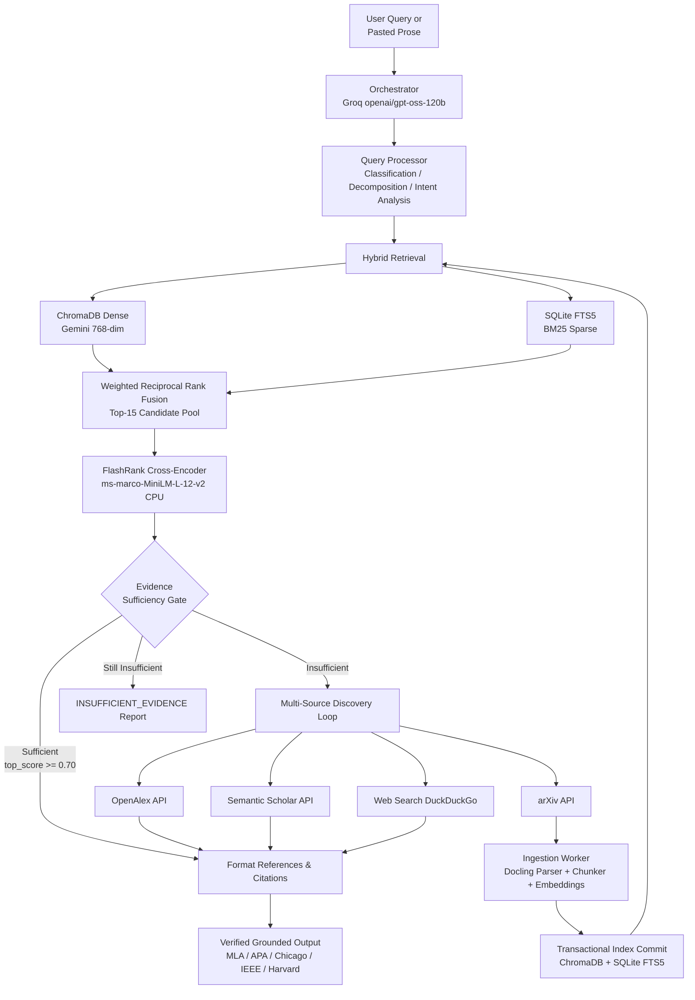

# Active Research Assistant

An **agentic hybrid-retrieval RAG pipeline** for academic literature discovery, layout-aware PDF ingestion, persistent indexing, cross-encoder reranking, evidence sufficiency gating, and **citation-ready reference output**.

Unlike static RAG systems that only search a pre-built corpus, this assistant actively **discovers new academic and web literature**, securely ingests and indexes arXiv PDFs on the fly, evaluates evidence sufficiency, and delivers verified, citation-grounded references across multiple academic and industry styles — or explicitly reports when sufficient evidence is missing.

For the in-depth architectural and engineering specification, see [AGENTS.md](./AGENTS.md).

---

## Key Highlights

- **Hybrid Retrieval & RRF** — Dense ChromaDB vector search (`gemini-embedding-001`, 768-dim) + Sparse SQLite FTS5 (BM25), combined via weighted Reciprocal Rank Fusion ($w_{\text{dense}}=0.6$, $w_{\text{sparse}}=0.4$, $k=60$).
- **Local Cross-Encoder Reranking** — FlashRank (`ms-marco-MiniLM-L-12-v2`) executing locally on CPU to score passage relevance.
- **Evidence Sufficiency Gate** — Deterministic gate evaluating candidate count and cross-encoder score against configurable thresholds (`MIN_RERANK_SCORE=0.70`). Triggers active discovery automatically when local knowledge is insufficient.
- **Multi-Source Discovery Engine** — Coordinated search across **arXiv**, **OpenAlex**, **Semantic Scholar**, and **Web Search (DuckDuckGo)**.
- **Intent-Aware Query Routing** — Automatically detects corporate and vendor queries (e.g., ServiceNow, enterprise architectures), prioritizing web and documentation citations while bypassing unnecessary arXiv PDF downloads.
- **Paste-to-Cite & Sentence-Level Spans** — Paste multi-sentence prose to automatically extract claim-level subqueries, map citations to each sentence span, and inspect interactive highlights in the Web UI.
- **6 Citation Standards** — Produces fully formatted in-text and bibliographic references in **MLA 9**, **APA 7**, **Chicago 17 (Author-Date)**, **IEEE**, **Harvard**, and **Internal Provenance** (`[arXiv:ID | Chunk N]`).
- **Layout-Aware PDF Ingestion** — Docling integration preserving two-column structures, headings, paragraphs, tables, equations, and figure captions into structured chunk records.
- **Gemini Key Rotator** — Dynamic round-robin rotation across multiple Gemini API keys to gracefully handle quota limits and HTTP 429 rate limits.
- **Production Web UI** — Modern dark-mode glassmorphism interface with ambient background animations, real-time progress indicators, interactive citation inspector, query history management, and one-click ZIP bundle exports.
- **Fast Mode Execution** — Instant pipeline tuning for ~1-minute cold starts with batched embeddings, parallel workers, and streamlined PDF parsing.
- **Transactional Indexing & Strict Security** — Atomic dual-writes with rollback across ChromaDB and SQLite FTS5, SHA-256 deduplication, path traversal containment, domain allowlists, and HTTPS enforcement.

---

## Architecture



---

## Core Capabilities

### 1. Hybrid Retrieval & Candidate Pooling
Queries are processed concurrently through two retrieval channels:
- **Dense Vector Search**: ChromaDB collection (`research_chunks_v1`) using Google Gemini embeddings (`gemini-embedding-001`, 768 dimensions) with cosine similarity.
- **Sparse BM25 Search**: SQLite FTS5 table indexed for exact term matching, arXiv IDs, technical terms, and acronyms.
- **Rank Fusion**: Combines ranked candidate lists using Reciprocal Rank Fusion:
  $$\text{RRF}(d) = \frac{0.6}{60 + \text{rank}_{\text{dense}}(d)} + \frac{0.4}{60 + \text{rank}_{\text{sparse}}(d)}$$
  The top 15 candidates are passed to the reranking stage.

### 2. Local Cross-Encoder Reranking & Sufficiency Evaluation
- Passages are evaluated jointly against the query using **FlashRank** (`ms-marco-MiniLM-L-12-v2`) running on local CPU.
- Top 3 passages are evaluated by the **Sufficiency Gate**:
  $$\text{candidate\_count} \ge 1 \quad \text{AND} \quad \text{top\_score} \ge 0.70$$
- If the threshold is not met, the system enters the active discovery workflow rather than fabricating unsupported claims.

### 3. Active Multi-Source Discovery
When local evidence is insufficient, discovery searches across configured sources:
- **arXiv**: Discovers candidate papers, downloads PDFs securely, parses document layouts via Docling, chunks section-aware text, generates Gemini embeddings in parallel, and commits dual index records.
- **OpenAlex**: Academic publication metadata retrieval.
- **Semantic Scholar**: Research paper discovery with optional API key support.
- **Web Search**: DuckDuckGo HTML search for vendor documentation, technical manuals, and corporate pages without requiring API keys.
- **Corporate Query Routing**: Topics involving products or enterprise platforms (e.g., ServiceNow, AWS, SAP) bypass arXiv PDF ingestion and prioritize web and academic metadata.

### 4. Paste-to-Cite & Interactive Span Highlighting
- Paste any paragraph or multi-sentence draft.
- The query processor breaks prose into sentence-level claim queries while preserving technical terminology and entity phrases.
- Results map sources directly to text spans (`CitationSpan`), allowing interactive click-to-view citation inspection in the UI.

### 5. Multi-Style Citation Engine
Supports 6 citation standards with verified provenance:
- **MLA 9th Edition**: Author. *"Title."* Venue, Year, URL.
- **APA 7th Edition**: Author. (Year). *Title*. Venue. URL
- **Chicago 17th Edition (Author-Date)**: Author. Year. *"Title."* Venue. URL
- **IEEE**: `[1]` Author, *"Title,"* Venue, Year. [Online]. Available: URL
- **Harvard**: Author (Year) *'Title'*, Venue. Available at: URL
- **Internal Provenance**: Machine-verifiable tags `[arXiv:ID | Chunk N]`

---

## Tech Stack

| Component | Technology / Model | Runtime / Engine |
|---|---|---|
| **Orchestration & Decomposition** | Groq — `openai/gpt-oss-120b` | Groq Cloud (Temperature 0.0) |
| **Embeddings** | Google Gemini — `gemini-embedding-001` (768-dim) | Gemini API (with Key Rotator) |
| **Dense Vector Index** | ChromaDB (`cosine` distance) | Persistent local storage (`./data/chroma_db`) |
| **Sparse Index** | SQLite FTS5 (`BM25` ranking) | Local database (`./data/sparse_index.db`) |
| **Cross-Encoder Reranker** | FlashRank (`ms-marco-MiniLM-L-12-v2`) | Local CPU |
| **Document Parser** | Docling (IBM Granite / Docling Core) | Local process (layout-aware) |
| **Academic Discovery** | arXiv API, OpenAlex, Semantic Scholar | Asynchronous HTTP clients |
| **Web Discovery** | DuckDuckGo HTML Search | Direct HTTP parser (no key required) |
| **Web UI** | FastAPI + Vanilla JS + CSS Glassmorphism | Async ASGI server (`http://127.0.0.1:7860`) |
| **CLI Framework** | Python `argparse` + structured logging | Command line executable |

---

## Installation

### Prerequisites
- **Python 3.11+**
- **Groq API Key** — [Groq Console](https://console.groq.com/)
- **Google Gemini API Key** — [Google AI Studio](https://aistudio.google.com/)
- ~2 GB disk space for Docling layout models (downloaded on first PDF parse)

### Setup

```bash
# Clone repository
git clone https://github.com/MHOC96/Active-Research-Assistant-Agent.git
cd Active-Research-Assistant-Agent

# Create and activate virtual environment
python -m venv .venv

# Windows
.venv\Scripts\activate

# macOS / Linux
source .venv/bin/activate

# Install package with development dependencies
pip install -e ".[dev]"
```

### Environment Configuration

Create a `.env` file from the provided template:

```bash
# Windows
copy .env.example .env

# macOS / Linux
cp .env.example .env
```

Configure your API keys in `.env`:

```env
# =========================
# Groq Cloud
# =========================
GROQ_API_KEY=gsk_your_groq_api_key_here
GROQ_MODEL=openai/gpt-oss-120b
GROQ_MAX_OUTPUT_TOKENS=2048

# =========================
# Google Gemini
# =========================
GOOGLE_API_KEY=your_primary_google_api_key
# Optional fallback keys rotated on rate-limits (HTTP 429)
GOOGLE_API_KEYS=key_one,key_two,key_three
GEMINI_EMBEDDING_MODEL=gemini-embedding-001
EMBEDDING_DIMENSION=768

# =========================
# Citations
# =========================
CITATION_STYLE=mla9
```

---

## Usage

### 1. Validate Configuration and API Health

```bash
# Verify configuration settings
research-assistant --check-config

# Validate live connectivity to Groq and Gemini APIs
research-assistant --check-config --validate
```

### 2. Launch the Web UI

```bash
research-assistant-ui
```

Navigate to **`http://127.0.0.1:7860`** in your browser.

**Web UI Features:**
- **Search & Paste-to-Cite**: Enter research questions or paste multi-sentence text.
- **Sentence Citation Inspector**: Click any highlighted sentence in the query editor to inspect its attached sources and in-text citations.
- **Fast Mode Toggle**: Ingest 1 paper with batched embeddings for quick ~1-minute results.
- **Style Selector**: Switch between MLA9, APA7, Chicago17, IEEE, Harvard, and Internal styles.
- **Query History**: Saved locally with one-click reload, re-run, and batch checkbox deletion.
- **Export Bundle**: Download a complete `.zip` archive containing:
  - `query.txt` — original input
  - `references.txt` — formatted bibliography
  - `manifest.json` — query metadata, segment spans, and citation mappings
  - `papers/*.pdf` — cached PDFs referenced in the citations (also saved in `./data/exports/`)

### 3. Command Line Interface (CLI)

#### Research Questions
```bash
# Standard research query
research-assistant "How does transformer self-attention work?"

# Specify citation style and verbose pipeline logging
research-assistant --citation-style apa7 --verbose "Compare RAG and GraphRAG on latency and hallucination rate"

# Fast mode for rapid cold-start discovery (~1 min)
research-assistant --fast --citation-style ieee "What are diffusion models in generative AI?"
```

#### Paste-to-Cite Paragraphs
```bash
research-assistant --citation-style apa7 "Cloud computing architectures rely on containerization to package applications with their complete runtime dependencies. Container engines enable horizontal scaling compared to virtualization. Orchestration frameworks handle rolling updates and self-healing."
```

#### Corporate / Vendor Documentation
```bash
research-assistant --citation-style apa7 "ServiceNow ITSM multi-instance architecture"
```

#### List Available Citation Styles
```bash
research-assistant --list-citation-styles
```

---

## CLI Reference

| Flag | Description |
|---|---|
| `query` | The research question or pasted paragraph to cite |
| `--check-config` | Display current configuration values and validate `.env` format |
| `--validate` | When used with `--check-config`, probes live Groq and Gemini APIs |
| `--skip-validation` | Skip startup API connectivity health checks |
| `--verbose` | Enable verbose informational logging across pipeline components |
| `--citation-style STYLE` | Output citation format: `mla9`, `apa7`, `chicago17`, `ieee`, `harvard`, `internal` |
| `--list-citation-styles` | List all supported citation formats and descriptions |
| `--fast` | Enable speed mode (1 paper limit, batched embeddings, streamlined parsing) |

---

## REST API Reference

The FastAPI backend exposes the following endpoints:

| Endpoint | Method | Description |
|---|---|---|
| `/` | `GET` | Serves the single-page research assistant application |
| `/api/health` | `GET` | Validates configuration integrity and external API connectivity |
| `/api/citation-styles` | `GET` | Returns list of available citation style IDs and descriptions |
| `/api/query` | `POST` | Executes full research pipeline (`query`, `citation_style`, `fast`) |
| `/api/query/cancel/{request_id}` | `POST` | Cooperatively cancels an in-flight query execution |
| `/api/export/bundle` | `POST` | Generates and streams a downloadable ZIP bundle with query, references, manifest, and cached PDFs |

---

## Configuration Reference

Key settings configurable via environment variables or `.env`:

| Setting | Default | Description |
|---|---|---|
| `GROQ_API_KEY` | `""` | API key for Groq Cloud |
| `GROQ_MODEL` | `openai/gpt-oss-120b` | Groq LLM model identifier |
| `GOOGLE_API_KEY` | `""` | Primary Google Gemini API key |
| `GOOGLE_API_KEYS` | `""` | Comma-separated Gemini fallback keys for automatic quota rotation |
| `GEMINI_EMBEDDING_MODEL` | `gemini-embedding-001` | Gemini embedding model |
| `EMBEDDING_DIMENSION` | `768` | Dense vector dimension |
| `RRF_DENSE_WEIGHT` | `0.6` | Weight assigned to dense vector ranks in RRF fusion |
| `RRF_SPARSE_WEIGHT` | `0.4` | Weight assigned to sparse BM25 ranks in RRF fusion |
| `RRF_K_CONSTANT` | `60` | Smoothing constant in RRF equation |
| `RRF_CANDIDATE_K` | `15` | Number of fused candidates passed to FlashRank reranker |
| `FINAL_TOP_K` | `3` | Maximum passages retained for evidence evaluation |
| `MIN_RERANK_SCORE` | `0.70` | FlashRank cross-encoder sufficiency threshold |
| `MIN_EXTERNAL_RELEVANCE_SCORE` | `0.35` | Minimum relevance threshold for OpenAlex/Web citations |
| `MIN_INDEXED_TOPIC_SCORE` | `0.30` | Minimum keyword overlap score for indexed arXiv references |
| `DISCOVERY_SOURCES` | `arxiv,openalex,semantic_scholar,web` | Comma-separated discovery sources |
| `DISCOVERY_PER_SOURCE_MAX` | `1` | Max top hits extracted per discovery source |
| `MAX_NEW_DOCUMENTS_PER_QUERY` | `3` | Maximum number of new arXiv PDFs ingested per query |
| `MAX_DISCOVERY_ROUNDS` | `2` | Maximum retry rounds for active literature discovery |
| `MAX_PDF_SIZE_MB` | `50` | Maximum allowable PDF download size |
| `DOWNLOAD_TIMEOUT_SECONDS` | `30` | PDF download timeout in seconds |
| `ALLOWED_DOWNLOAD_DOMAINS` | `arxiv.org,export.arxiv.org` | Comma-separated trusted domains for PDF downloads |
| `FAST_INGESTION` | `false` | Enable lightweight parsing and batched ingestion defaults |

---

## Project Structure

```text
src/research_assistant/
├── bootstrap.py            # Application dependency injection and wiring
├── cli.py                  # CLI command parser and runner
├── config.py               # Pydantic BaseSettings and runtime configuration
├── health.py               # Startup configuration and external service health checks
├── models.py               # Shared Pydantic domain models and enums
│
├── citations/              # Citation generation and validation
│   ├── spans.py            # Sentence-level text span to citation mapping
│   ├── styles.py           # MLA, APA, Chicago, IEEE, Harvard formatters
│   └── validator.py        # Provenance pattern validation and chunk index checks
│
├── discovery/              # Active literature discovery engine
│   ├── arxiv.py            # arXiv API integration and metadata extraction
│   ├── multi.py            # Multi-source discovery orchestrator and deduplication
│   ├── openalex.py         # OpenAlex academic entity search
│   ├── publisher.py        # Domain-to-publisher heuristics
│   ├── query_intent.py     # Corporate vs academic query classification
│   ├── relevance.py        # Text and token overlap relevance scorers
│   ├── semantic_scholar.py # Semantic Scholar API integration
│   ├── sources.py          # Discovery source registry
│   └── web.py              # DuckDuckGo HTML search integration
│
├── embeddings/             # Embedding services
│   ├── base.py             # Base embedder interface
│   ├── gemini.py           # Gemini embedding client with batching
│   └── key_rotator.py      # Multi-key rate-limit rotation handler
│
├── export/                 # Export generators
│   └── bundle.py           # ZIP bundle packager (query, references, manifest, PDFs)
│
├── ingestion/              # Document parsing and indexing pipeline
│   ├── chunker.py          # Section-aware token chunker with overlap
│   ├── downloader.py       # Secure HTTPS PDF downloader
│   ├── parser.py           # Docling layout-aware document parser
│   └── worker.py           # Transactional ingestion worker
│
├── orchestrator/           # High-level orchestration
│   ├── agent.py            # Research orchestrator coordinating retrieval & citations
│   ├── llm.py              # Groq chat client with automatic retry
│   ├── paste_to_cite.py    # Prose decomposition and claim-query extractor
│   ├── query_processor.py  # Intent analysis, normalization, and decomposition
│   └── synthesis.py        # Citation-grounded synthesis and provenance replacement
│
├── pipeline/               # Core active loop
│   └── active_loop.py      # Retrieve -> Evaluate -> Discover -> Ingest -> Re-retrieve loop
│
├── reranking/              # Cross-encoder reranking
│   └── flashrank_reranker.py # FlashRank ms-marco-MiniLM-L-12-v2 CPU runner
│
├── retrieval/              # Hybrid retrieval
│   ├── hybrid.py           # Dense ChromaDB + Sparse FTS5 orchestrator
│   └── rrf.py              # Weighted Reciprocal Rank Fusion algorithm
│
├── security/               # Guardrails & safety
│   ├── paths.py            # Path traversal prevention and directory containment
│   └── urls.py             # HTTPS validation and domain allowlist enforcement
│
├── storage/                # Persistence layer
│   ├── dense_index.py      # ChromaDB collection wrapper
│   ├── index_transaction.py# Dual-index transaction coordinator with rollback
│   ├── metadata_store.py   # SQLite document metadata & ingestion state
│   └── sparse_index.py     # SQLite FTS5 BM25 search table
│
├── sufficiency/            # Evaluation gate
│   └── gate.py             # FlashRank score and candidate count sufficiency gate
│
├── utils/                  # Shared utilities
│   ├── cancellation.py     # Cooperative cancellation token registry
│   ├── concurrency.py      # Thread-pool IO execution helper
│   ├── retry.py            # Exponential backoff retry decorator
│   └── token_efficiency.py # Query caching and passage truncation
│
└── web/                    # Web application
    ├── app.py              # FastAPI application and REST endpoints
    ├── serve.py            # Uvicorn launcher script
    └── static/             # Frontend assets (index.html, styles.css, app.js)

data/                       # Persistent runtime directory (gitignored)
├── chroma_db/              # Dense vector database
├── sparse_index.db         # SQLite FTS5 full-text database
├── metadata.db             # Ingestion metadata SQLite database
├── downloads/              # Downloaded academic PDFs
└── exports/                # Generated query ZIP bundles

tests/                      # Comprehensive test suite (139 tests)
```

---

## Testing

The project includes an extensive test suite of **139 unit and integration tests** covering all modules:

```bash
# Run all tests
pytest

# Run tests with verbose output
pytest -v

# Run specific test modules
pytest tests/test_hybrid_retrieval.py -v
pytest tests/test_paste_to_cite.py -v
pytest tests/test_web_ui.py -v
pytest tests/test_gemini_embeddings.py -v
pytest tests/test_export_bundle.py -v
```

---

## License

Distributed under the **MIT License**. See [LICENSE](./LICENSE) for details.
